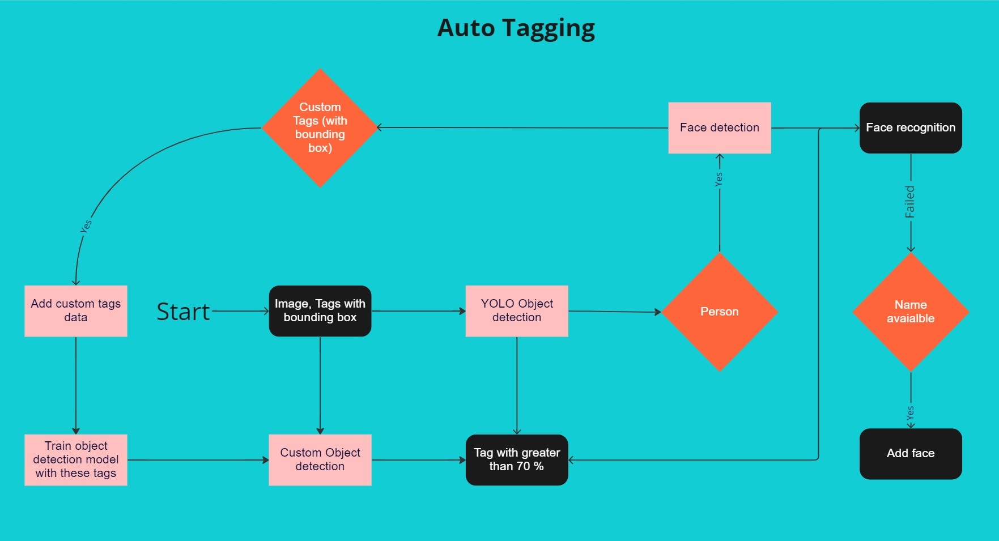
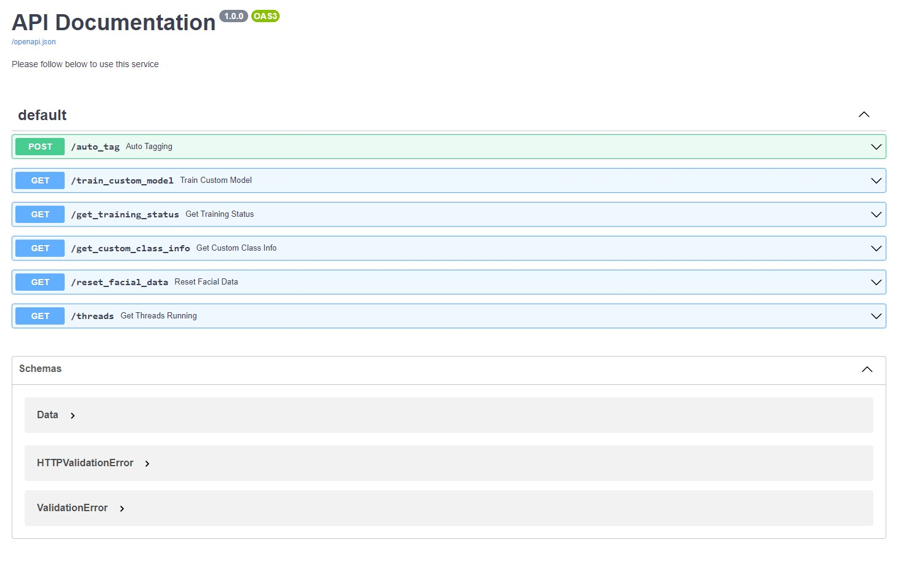

# Auto Tagging

This app allows one to generate tag's for any image extending Yolov8 and vggface2 model. This can also learn new tags on the fly.

## Features

- Detect object (using Yolov8)
- Recognize faces (facenet-pytorch)
- Train on custom classes (Using Yolov8 pretrained model)
- Train to recognize faces (With 1 image per class)
- Extended multi-threaded APIs (using fastAPI)
- Dockerized App
- Swagger Documentation available

## Installation

### Run with docker

```bash
  docker-compose build
  docker-compose up
```

### Run without docker

#### Use virtualenv

```bash
  cd fastapi
  pip install virtualenv
  virtualenv virtualenv
  source venv/Scripts/activate
```

#### Installing dependencins

```bash
  pip install -r requirements.txt
  pip install opencv-python
  pip install torch torchvision --extra-index-url https://download.pytorch.org/whl/cpu     # For CPU
  pip install torch torchvision --extra-index-url https://download.pytorch.org/whl/cu117   # For GPU
```

#### Running

```bash
  uvicorn server:app --host 0.0.0.0 --port 8000
```

#### Swagger Links

- http://127.0.0.1:8000/docs
- http://127.0.0.1:8000/redoc

## Flow Diagram



## Swagger



## Acknowledgements

- [Yolov8](https://github.com/ultralytics/ultralytics)
- [MTCNN + face-net pytorch](https://github.com/timesler/facenet-pytorch)
- [fastAPI](https://fastapi.tiangolo.com/)

## Authors

- [@Ashes47](https://github.com/Ashes47)

## Feedback

If you have any feedback, please reach create an issue

## License

[MIT](https://choosealicense.com/licenses/mit/)
